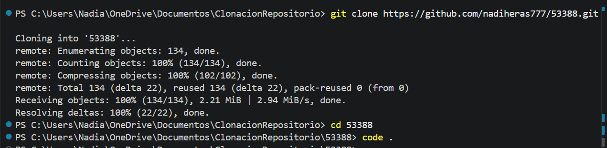
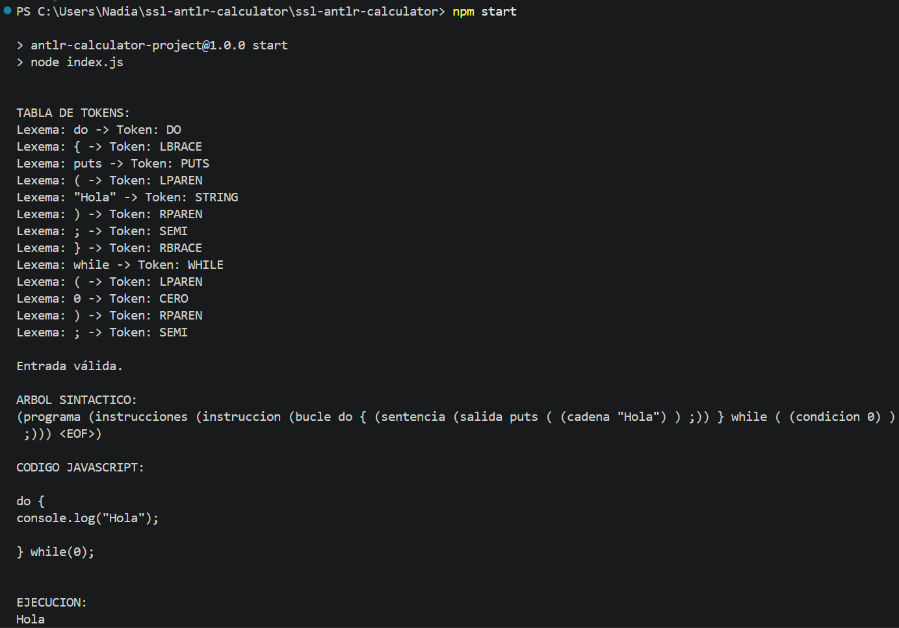
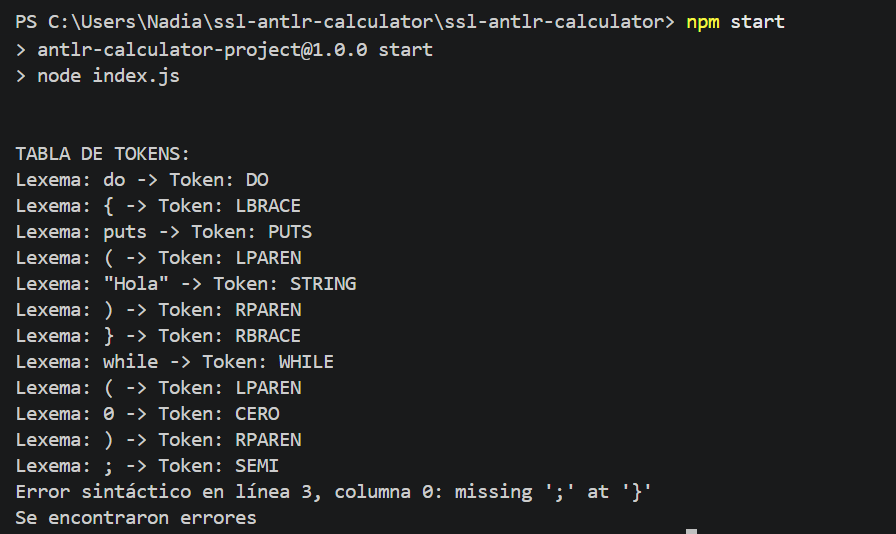

# Tarea construcción ANALIZADOR con ANTLR4 y JavaScript

# Tema 39568_10

Este proyecto implementa un analizador léxico y sintáctico para un subconjunto reducido del lenguaje C utilizando ANTLR4 y Node.js.

El analizador reconoce estructuras `do while`, sentencias `puts` y `break`, realizando:

- análisis léxico
- análisis sintáctico
- generación de tabla de tokens
- construcción del árbol sintáctico
- traducción a JavaScript
- ejecución del código traducido

---

# Características de la Gramática

- Soporta estructuras `do { ... } while(condicion);`

- Permite sentencias `puts("texto");`

- Reconoce la sentencia `break;`

- Soporta condiciones simples `0` y `1`

- Permite múltiples sentencias dentro del bloque

- Gramática desarrollada en ANTLR4

- Traduce automáticamente el código fuente a JavaScript

- Ejecuta el código JavaScript generado

---

# Requisitos

1. Node.js v16 o superior  
https://nodejs.org/es

2. Java Runtime Environment (JRE) para ANTLR4  
https://www.java.com/es/download/

3. Visual Studio Code  
https://code.visualstudio.com/

4. Git  
https://git-scm.com/downloads

---

# Configuración Inicial

Estas instrucciones pueden ejecutarse desde:

- CMD
- PowerShell
- GitBash
- Terminal de VS Code
- Linux/macOS terminal

---

# Pasos

1. Clonar el repositorio

```bash
git clone https://github.com/nadiheras777/53388.git
```

2. Entrar al proyecto
```bash
cd 53388
```
3. Abrir Visual Studio Code
```bash
code . 
```
EJEMPLO: 

---

# Uso del Proyecto
## Archivo de entrada

El programa utiliza el archivo:

input.txt

Dentro del mismo se escribe el código fuente a analizar.

Ejemplo:
```bash
do {
   puts("Hola Mundo");
} while(0);
```
## Ejemplos incluidos:
El proyecto incluye:

- EjemploValido1.txt
- EjemploValido2.txt
- EjemploInvalido1.txt
- EjemploInvalido2.txt

Los mismos pueden copiarse dentro de input.txt para probar el analizador.

# EJECUCION
Desde la terminal ejecutar:
```bash
cd ssl-antlr-calculator
```
Luego:

Elegir unos de los ejemplos incluidos en el proyecto, copiarlo y pegarlo dentro del archivo "input.txt" que se encuentra dentro de la carpeta "ssl-antlr-calculator".

Ahora en la terminal ejecutamos:
```bash
npm start
```
# SALIDA DEL PROGRAMA

El analizador muestra:

- tabla de lexemas y tokens
- errores sintácticos
- línea y descripción del error
- árbol sintáctico
- código JavaScript generado
- ejecución del código traducido

EJEMPLO:




# COMENTARIOS FINALES

Proyecto desarrollado por Nadia Heras (53388) para la materia Sintaxis y Semantica de los Lenguajes utilizando ANTLR4 y JavaScript.

El repositorio incluye todos los archivos necesarios para ejecutar y probar el analizador.
Gracias por su tiempo. 


